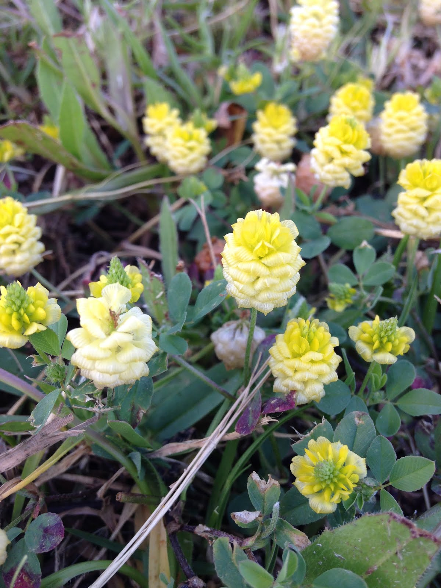
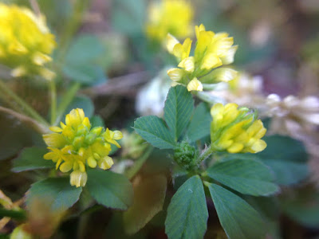
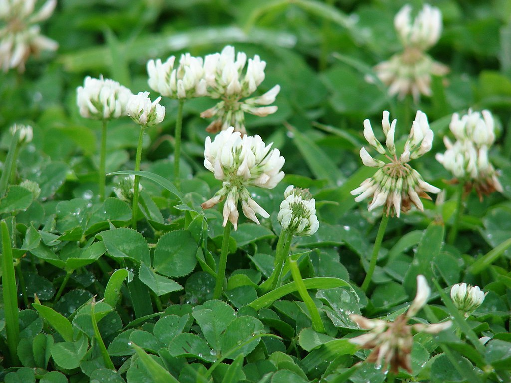
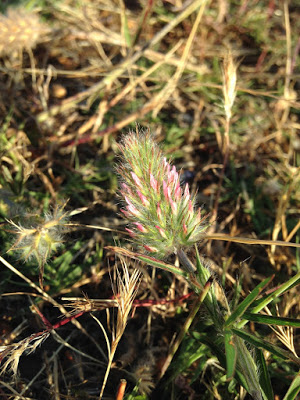

~~A serial theme for blog posts sounds like the kind of thing I'd like to busy myself with--why not write about groups I've been reading about?~~ Edit: I never made more than one of these clade-focussed posts. Oh well!

Clovers then! I stumbled upon my love of this wonderful little creeping herbs by coming across them in green spaces and lawns this spring. They are mostly weeds here in the southwestern corner of South Africa, as far as I can tell. But what beautiful weeds!

Starting with the basics, the genus *Trifolium*---commonly known as clovers---belongs to the family Fabaceae---the pea family. It is one of the largest genera (ca. 225 spp.) in the third largest family of flowering plants (ca. 19,325 spp.) ([Ellison et al., 2006](http://www.sciencedirect.com/science/article/pii/S105579030600011X)), and exhibits a near cosmopolitan distribution, save southeast Asia and Australia (Ellison et al., 2006). So they're nearly everywhere, and there are lots of different kinds.

Clovers are commonly grown as fodder (*T. repens* especially). Being legumes, clovers contain symbiotic nitrogen fixing bacteria (rhizobia) in nodules on their roots. This allows them to increase the amount of nitrogen available for their own use, and also provide nitrogen supplement to the surrounding vegetation from the surplus. This is likely a benefit to using them in crops. They're agricultural uses have lead to clovers being naturalised almost worldwide.

Nearly all of them are herbaceous, perennial or annual, and low to the ground. Their characteristic feature (and namesake's) is a compound leaf made up of three leaflets. They have the classic papilionoid pea-flowers, arranged in dense heads or spikes. (Ellison et al., 2006)

There isn't an awful lot more I'd like to say, as my interest in clovers is quite recent. But I just wanted to indulge myself and talk about them, and share some photos of some I've seen.

And boy, do I think they look cool. Here are some that I've seen in my surrounds (with some dubious identifications--I mostly used Wikipedia)

_These puffy yellow delightful clovers may be *T. campestre*? Or *T. aureum*? I haven't stumbled upon others online that look more similar to it._

_I think these are definitely *T. dubium*---the little hop clover. This is accepted to be the famous traditional Irish shamrock. They grow in abundance on my lawn, and are very fun to get up close to with a macro lens. It's very exciting to find things this beautiful growing all around you._

_This photo is not my own (from [Wikipedia](https://en.wikipedia.org/wiki/Trifolium_repens#/media/File:Starr_070313-5645_Trifolium_repens.jpg)), but I see this growing all around town. *T. repens*, the dutch or white clover, makes an exciting site, making large patches of white against green._

_And then there's this one from my neighbourhood. I've seen it in reserves too, next to paths. It's got quite narrow leaflets, and a hairy inflorescence, with pink, narrow flowers._

And there are many more species, of course! Have a Google of "clovers" and "*Trifolium*", and you'll find a lot of very beautiful flowers--red, pink, white, long, round, thin, bright, or subtle.

---Ruan

---

## References

Ellison, N.W., Liston, A., Steiner, J.J., Williams, W.M. & Taylor, N.L., 2006. Molecular phylogenetics of the clover genus (*Trifolium*---Leguminosae). *Molecular Phylogenetics & Evolution*, 39(3): 688---705.
