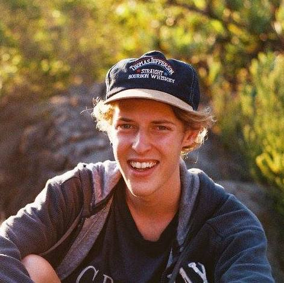

# About the scientist: *Ruan van Mazijk*

 
 

Hi! I'm Ruan, a South African ecology and evolutionary biology Masters student at the Dept. of Biological Sciences, University of Cape Town.

I am most fascinated by phylogenetic systematics, plant ecophysiology, phylogenetic ecology and evolutionary biology in general. Find me as @rvanmazijk on  [Twitter](https://twitter.com/rvanmazijk) and  [Github](https://github.com/rvanmazijk). My CV is [here](cv/RvanMazijk_CV.md) (downloadable PDF [here](cv/RvanMazijk_CV.pdf)).

[My MSc](https://rvanmazijk.github.io/MSc-genome-ecophys/) has me investigating the links between genome size and ecophysiological limitations, such as water-use efficiency, in the Cape Schoenoid sedge genera *Schoenus* and *Tetraria*. I'm using morphological, physiological and phenological data to ascertain how (or if) rampant polyploidisation events in the *Schoenus* lineage affect those species ecology.

# Migrated posts from Blogspot:

- [What determines a species range? Thoughts about SDMs and niches](posts/sdms-and-niches.md)
- [Identifying and thinking about a weed](posts/weed-id.md)
- [The clovers (Fabaceae: *Trifolium* spp.)](posts/clovers.md)
