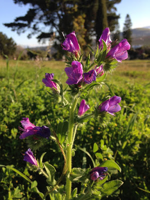
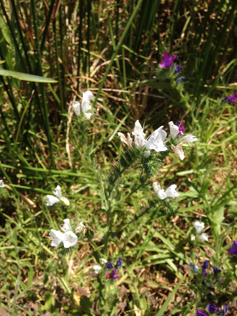

# Identifying and thinking about a weed

Living in the same city your whole life means you develop a sense of familiarity with the weeds in gardens and along roads and in fields. I suppose that is arguably conditional on your being ecologically inclined, however.

Either way, in the past three months (spring in this part of the world) I have been particularly aware of these:

These plants grow *en masse* here in the Western Cape, South Africa, as invasive weeds: basically everywhere there's space or disturbance, in usually large sprawling patches. My confusion about the identity of this weed follows.

Stumbling upon this species' identity in an illustrated book of British flora (I forget which), I made note that this was indeed *Echium vulgare*, a.k.a. viper's bugloss, or blueweed. My identification seemed to concur with my knowledge at the time: *E. vulgare* is indeed [invasive in the Western Cape](http://www.invasives.org.za/legislation/item/244-blue-echium-echium-vulgare), concurring with the droves of it I see around me; and its flowers were incredibly similar to those illustrated in the book I saw.

However, upon closer inspection, I may have misidentified it:

 is *E. vulgare*... (photo credit in link)](weed-id/Echium-vulgare.jpg)

 is [*E. plantagineum*](http://www.invasives.org.za/legislation/item/243-patterson-s-curse-echium-plantagineum), a.k.a. Paterson's curse (photo credit in link).](weed-id/Echium-plantagineum.jpg)

My confusion likely arose because the book I consulted didn't have depictions of the branches or inflorescence structure, only the flowers and leaves separately. At least, that's what I remember. Either that or I wasn't observant enough and just blindly assumed it was *E. vulgare*.

And, to be honest, I'm still not 100% convinced of which I am seeing more often. As they are both invasive here, it is actually very likely I am seeing [both](http://www.invasives.org.za/legislation/item/243-patterson-s-curse-echium-plantagineum) quite often. Only until now I had treated these purple flowering plants as one species. What also precluded my noticing that they are two separate species, morphologically speaking, is that one of them (or both?) has a very variable habit; I have a hunch it's *E. plantagineum*.

What finally convinced me that I was indeed seeing *E. plantagineum* in some places was this:

Before explaining exactly how this proves that at least this population is *E. plantagineum*, I must expand on the interesting topic of these white flowers.

I have seen the white flower form only a handful of times, and only ever on one or two plants in a population/area. How does this polymorphism persist in a population at such a low frequency? This started to be a fidgety thought in the back of my head for a few weeks.

I had reason to believe the white form wasn't yet another separate species. Evident [here](http://www.microscopy-uk.org.uk/mag/indexmag.html?http://www.microscopy-uk.org.uk/mag/artoct11/bj-White-Vipers-Bugloss.html), I was yet again held to believe I was dealing with *E. vulgare* (extremely beautiful photos in the link, by the way. Interesting details on the species too). Whether I am or not is not of too much concern. The really interesting stuff is about the white flowers themselves.

I found [this](http://www.jstor.org./stable/pdf/2259584.pdf) paper, by Burdon et al. (1983). Therein, they described numerous demographic and genetic findings for populations of *E. plantagineum* in its native Europe. They have a section about the white form of this species! To summarise, the white form is less common in higher density populations, and is generally weaker and less competitive than the purple, 'wild' form. They conclude that the white form does not persist, in the genealogical sense. Rather, the white forms reappear in each generation as the result of some inevitable recurrent inbreeding in each reproductive cycle. The white flowers thus denote a weaker, inbred, individual. This explains how the form appears in populations stably, yet so very rarely.

Now, aside from the wonder I feel towards this conclusion, it does also give me evidence to say that I am likely seeing *E. plantagineum* more often in my area.

On a perhaps unnecessarily profound note, this little journey with this weed has reminded me to appreciate the secrets that can explain the variety of organismal forms I see in my own backyard, so to speak.

---Ruan

---

## References

Burdon, J.J., Marshall, D.R. and Brown, A.H.D., 1983. Demographic and genetic changes in populations of *Echium plantagineum*. *The Journal of Ecology*, 667---679.
